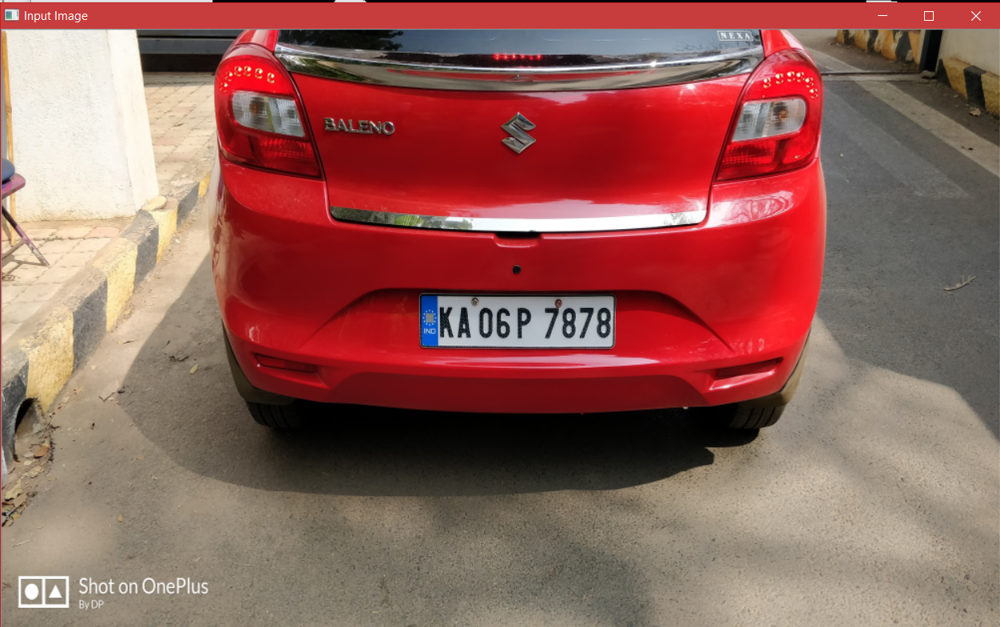
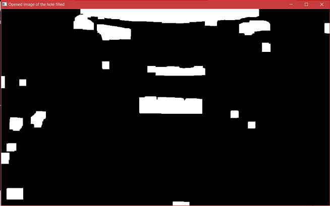

# Vehicle-License-Plate-Detection
In an ALPR system, the first and most vital phase is the identification and extraction of number plate. This section intends about locating the vehicle number plate from the video frame or image of the captured vehicle. A well known Indian automobile number plate is a metallic rectangular plate bearing an alphanumeric ID of 9/10 digits connected to a motor vehicle. An ALPR system extracts number plate bearing the existence of increased vertical and horizontal edges and most eminent corner points due to contrast characters on the vehicle license plate. But in some cases, as mentioned in the literature review, this
process can detect a non-license plate region, each of which has unique complexity and difficulty. The proposed approach is a fusion of edge analysis, morphological operations, Connected Component Analysis (CCA) and global image features such as area, aspect ratio, length of column-row, spectrum analysis, and detection of corner points. This part reviews explanation on the suggested number plate identification and extraction algorithm.

# Block Diagram
The block diagram of vehicle plate detection and extraction is as shown in the below figure 

# 1. PreProcessing 
Input images for project
#

The input color image is converted into gray scale images.
#
Gray scale of input images
#
#
The extracted vehicle will be low contrast and blurred due to poor lighting conditions and distance of vehicle from the camera. This section intends to increase the quality of image acquired by de-noising and improving the contrast of image. Bilateral filter is a non-linear filter which is used to smoothen the image with reduced blurring effect and
noise by more efficiently maintaining edges than median filter as shown in Figure below.

#
To improve the contrast, filtered image undergoes Adaptive Histogram Equalization(AHE).
AHE performs better than a simple histogram equalization, since AHE relies on gray level,
local characteristics and spatial co-ordinates of picture elements with Peak Signal Noise
Ratio(PSNR), where as HE relies merely on the gray levels of picture elements having
low PSNR.

# 2. Edge Analysis 
To detect edges, binary image undergoes sobel operation along x and y axis. The purpose is locating boundaries of some objects having vertical and horizontal edges in an image.
Morphologically opened images
#

#
Difference images
#

#
Preprocessed Binary images
#

#
# 3. Spectral Analysis
#
Edge analysed images
#

#
Dialted Edge
#

#
Hole filled
#

#
Morphologically opened images
#

#
Eroded Images
#

#
Applying CCA and identifying the regions the region which is having more area is termed as license plate. In order to identify precisely use spectral anaylsis. 
#

#

#
Number plate detected
#

